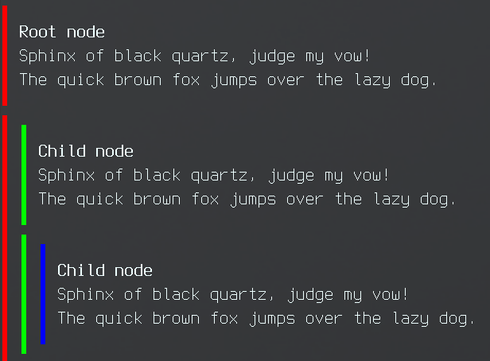

## Conversation

This example shows a threaded conversation with elements being multi-line.

```sh
$ go run . -depth 2
  │
  │  Lorem ipsum dolor sit amet
  │  consectetur adipiscing elit
  │  vivamus ullamcorper magna auctor
  │  iaculis volutpat mi curabitur
  │  bibendum. Dictum auctor facilisi
  │  feugiat condimentum vivamus libero
  │
  │  │
  │  │  Lorem ipsum dolor sit amet
  │  │  consectetur adipiscing elit
  │  │  vivamus ullamcorper magna auctor
  │  │  iaculis volutpat mi curabitur
  │  │  bibendum. Dictum auctor facilisi
  │  │  feugiat condimentum vivamus libero
  │  │
```

Or with colours:


